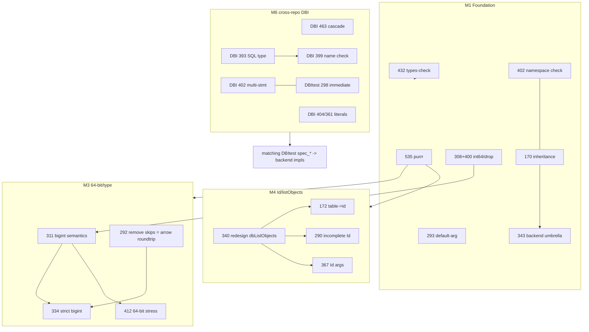

# DBItest / DBI open-issue triage & roadmap

_Snapshot: 2026-07-22. DBItest `1.8.2.9020` (dev), DBI `1.3.0.9010` (dev)._

Covers **39 open DBItest issues** (primary) and **15 open DBI issues** (secondary).
Each issue was read together with its full discussion thread; both codebases were
mapped to pin down feasibility, exact file locations, and dependencies.

## The organizing principle

DBItest **is** the executable specification: DBI's man pages `@inherit` their
`return` / `Failure modes` / `Specification` prose from `DBItest::spec_*` at build
time (132 such references across 41 DBI source files). Consequences that drive the
ordering below:

- Any **new DBI generic, argument, or behavior is a two-repo change minimum**
  (DBI generic + DBItest spec), and usually an N-repo change once
  RSQLite / RPostgres / RMariaDB / duckdb implement it.
- The correct sequence for feature work is **spec first, backends second**.
- Fixing the *test harness itself* (so it stops giving wrong answers) must precede
  expanding coverage — otherwise new specs inherit old bugs.

---

## 0. Close now — no implementation needed

| # | Repo | Title | Disposition |
|---|------|-------|-------------|
| 428 | DBItest | "Who is the maintainer? … can I spend their tokens?" | Noise. **Close.** |
| 429 | DBItest | Use testthat edition 3 | **Already done** — `Config/testthat/edition: 3` since v1.7.3 (2022); `expect_is()` etc. removed. The live sub-thread ("run `testthat::test()` as a tool") is already satisfied: `claude.yaml` sets `allowed_tools: Bash, R`. **Close.** |
| 430 | DBItest | Post comments after a failure | **Already implemented** — `.github/workflows/claude.yaml` has a `Post failure comment` step gated on `if: failure()`. Verify wording, then **close.** |
| 488 | DBI | `dbWriteTable(value = <SQL query>)` | Consensus moved the fix to dbplyr's `compute(temporary = FALSE)` (hadley agreed to a PR there). **Downgrade / won't-fix in DBI.** |
| 516 | DBI | Interface for retries | Greenfield, no maintainer buy-in, no natural hook in the thin generics. Belongs in a wrapper or `pool`. **Defer / won't-fix.** |

---

## Milestones

### M1 — Foundation & harness trust _(do first — unblocks everything)_

Removes churn risk and fixes the suite producing **wrong results**, which must land
before coverage grows.

| # | What | Effort | Location / dependency |
|---|------|--------|-----------------------|
| 535 | Review & reapply/re-evaluate the reverted purrr change | S–M | Filed 2026-07-22. Revert `69cdd51` undid `#421` across 23 files; currently on the `compat-purrr.R` shim. Decide direction **before** other spec edits to avoid conflicts. |
| 432 | Vendor rlang `types-check` standalone; apply `check_*()` | M | Not yet in repo (bot branches unmerged). Do early — it's the tooling for the "inline the checks" refactors. |
| 293 | Constructor default `""` false positive | S | `R/expectations.R:16-18` — `nzchar(as.character(arg))` cannot distinguish a missing default from a `""` default. Test the empty symbol instead. |
| 308 + 400 | integer64 / `drop = TRUE` mangling in `test_select()` | M | **Fix together** — same helper (`R/spec-result-roundtrip.R:275`, `:332/:334`). `rows[1L, i]` drops a 1×1 selection to a bare vector, destroying the `integer64` class. Root cause of unreliable bigint comparisons → gates M3. #400 has MC's lean toward `drop = TRUE`. |
| 402 | Namespace-only compliance check is faulty | M | `R/spec-compliance-methods.R:52-75`. **Consensus:** hadley says backends should *not* re-export DBI generics. Change the `reexport` test to inspect `NAMESPACE` / `importClassesFrom` instead of requiring re-export. |
| 170 | Explicitly require inheritance from DBI classes | S | Compliance test; pairs with #402. |
| 343 | Fix backend tests (RMariaDB / RPostgres / adbi `AsIs` / sql-server `Id`) | — | Umbrella tracker; resolves *as* the above land. Re-verify rather than schedule standalone. |

### M2 — Docs & onboarding _(independent — run in parallel with anything)_

| # | Repo | What | Effort |
|---|------|------|--------|
| 310 | DBItest | Vignette section "When a test fails": how to run one test (`test_some()`) and find its source. hadley explicitly asked for a discoverable heading. | S |
| 358 | DBI | Document the `pool` keepalive trick (you flagged "need a place to document this"). | S |
| 532 | DBI | Document the closure-based finalizer pattern in `?dbDisconnect`. | S |
| 252 / 339 | DBI | Data import/export + tutorial content in `DBI-1.Rmd` / `DBI-advanced.Rmd`. | M |

### M3 — 64-bit / type semantics _(depends on M1: #308 + #400)_

| # | What | Order / dependency |
|---|------|--------------------|
| 311 | Define `bigint = "integer64"` semantics (adbi always returns int64) — likely a tweak akin to `logical_return`. | **first in cluster** |
| 334 | "strict" bigint mode (`integer-strict` / `numeric-strict`); expand `data_64_bit_*` specs. | after #311; arrow items also need #292 |
| 412 | Stress 64-bit edges (non-representable ints 2^55–2^63, `NULL` vs `-2^63`). | after #311 |
| 264 | `dbDataType()` for zero-length vectors (`list()`, `list_of()`). | type-adjacent; can run independently |
| 292 | Remove unconditional `skip()`s. | The only 6 truly-unconditional skips are arrow stubs (`R/spec-arrow-append-table-arrow.R:187/202/220`, `R/spec-arrow-write-table-arrow.R:426/440/457`) whose message is *"Need to enhance `test_arrow_roundtrip()`"* — so #292 ≈ finishing arrow 64-bit roundtrip, overlapping #334. |

### M4 — Identifier / `Id()` / `dbListObjects()` _(design-gated cluster)_

| # | What | Order |
|---|------|-------|
| 340 | Redesign `dbListObjects()` (`prefix_level = c("catalog", "schema", …)`). | **design anchor — decide first** |
| 172 | `dbListObjects()` `"table"` → `"id"` column (keep `"table"` for back-compat). | implements part of #340 (`R/spec-sql-list-objects.R:19-28`) |
| 290 | Spec `dbQuoteIdentifier()` for incomplete `Id()` (terminal-dot behavior). | after design (`R/spec-sql-unquote-identifier.R`) |
| 367 | Table fns with named/unnamed `Id()` + `catalog.schema.table`; default schema/catalog as a tweak. | after design |

### M5 — Spec-coverage backlog _(largely independent; parallelizable sub-clusters)_

- **Encoding:** #149 (`dbQuoteString` UTF-8), #156 (invalid Unicode — mostly fixed
  upstream already; add graceful-handling test), #173 (Windows column-name encoding
  not caught).
- **BLOB / list columns:** #161 (long strings/blobs to ~64k), #294 (all-NULL lists →
  BLOB), #338 (test `vctrs_list_of`, drop `list(raw())`).
- **`dbAppendTable`:** #259 (0-row tables), #262 (`Id` objects).
- **Result / statement:** #158 (result invalidated when a new one opens), #160
  (`dbRowsAffected` after drop), #261 (`RETURNING` — duckdb-driven), #298 (multiple
  statements with `immediate = TRUE`), #369 (duplicate column names).
- **Helpers:** #127 (`sqlData()` + helpers — labelled *ready*), #144 (tweak to
  invalidate a connection).

### M6 — Cross-repo DBI features _(spec-first → backends)_

Ordered by readiness / value:

1. **DBI #463 — `cascade` for `dbRemoveTable()`.** _Cleanest of all._ Direct
   precedent: `fail_if_missing` / `temporary` already ride in `...` (not the generic
   signature) and are DBI-spec, not DBI-generic. ~0 DBI-core code → paragraph in
   `spec_sql_remove_table` → backends append `" CASCADE"`. Approach already agreed.
2. **DBI #393 — SQL type in `dbColumnInfo()`.** Foundational. The spec already permits
   `.`-prefixed optional columns, so a standardized `type.sql` is a
   `spec_meta_column_info` change + backends. **Enables → DBI #399**
   (`dbWriteTable` output-column-name check; note `dbAppendTable_DBIConnection.R`
   currently binds **by position, not name** — the substance of the concern).
3. **DBI #404 + #361 — literal-quoting robustness.** One-line `sprintf("%.17g")` in
   `dbQuoteLiteral_DBIConnection.R:55`, **but** #404's earlier fix was reverted for
   revdep failures — must be type-guarded + snapshot/`spec_sql_quote_literal` update +
   a revdep run. #361 (Inf needs cast) is the same area (per-driver `dbQuoteLiteral`,
   RPostgres) plus a `?dbBind` doc note.
4. **DBI #402 ↔ DBItest #298 — multi-statement.** Design-heavy; community wants native
   driver passthrough only (no R-side SQL splitting). Pair the DBI generic decision
   with the DBItest `immediate = TRUE` test.
5. **DBI #413 — `check_dots_used()`.** New rlang dependency; risk of false positives
   because `...` is deliberately forwarded to backend methods. Design carefully.

### Defer / external

- **DBItest #348 (Oracle):** needs an Oracle testbed (Docker XE 19/21). Infra-heavy,
  external. Defer until a CI Oracle image exists.
- **DBI #365 (R's `R-data.html`):** not this repo; draft already exists in
  `krlmlr/r-svn`, awaiting an R-dev-day slot. Track externally.

---

## Dependency graph



Text form of the load-bearing edges:

- `#308+#400` → `#311` → {`#334`, `#412`}; `#292` (arrow) → `#334`.
- `#402` ⟷ `#170` → `#343` (umbrella).
- `#535`, `#432` are foundation — precede spec-file churn and the "inline checks" work.
- `#340` (design) → {`#172`, `#290`, `#367`}.
- DBI `#393` → DBI `#399`; DBI `#404` ⟷ DBI `#361`; DBI `#402` ⟷ DBItest `#298`.
- **Every M6 DBI item** → matching DBItest `spec_*` → backend implementations.

---

## Suggested execution order

```
M1  →  (M2 in parallel)  →  M3  →  M4  →  M6 #463 & #393  →  M5 backlog  →  M6 #404/#361, #402/#298, #413  →  defer
```

Rationale: M1 makes the harness trustworthy and settles the purrr/validation churn;
M2 floats free and can be picked off anytime; M3 needs M1's integer64 fix; M4 is
self-contained behind one design call (#340); M6 #463/#393 are the highest-value,
lowest-cost DBI features and #393 unlocks #399; the M5 backlog is steady-state
coverage work that slots into any gap.

---

## Appendix — full issue index

### DBItest (39)

| # | Milestone | Relevance | One-line |
|---|-----------|-----------|----------|
| 127 | M5 | keep | Spec `sqlData()` and helpers (labelled *ready*). |
| 144 | M5 | keep | Tweak to invalidate a connection (backends surviving serialization). |
| 149 | M5 | keep | Test UTF-8 encoding of `dbQuoteString()`. |
| 156 | M5 | low | Invalid-Unicode strings; largely fixed upstream — add graceful test. |
| 158 | M5 | keep | Result set becomes invalid when a new one is created. |
| 160 | M5 | keep | Sensible `dbRowsAffected()` after dropping a table. |
| 161 | M5 | keep | Roundtrip of long strings and blobs (~64k). |
| 170 | M1 | keep | Require inheritance from DBI classes (pairs with #402). |
| 172 | M4 | keep | `dbListObjects()` `"table"` → `"id"` column. |
| 173 | M5 | low | Why aren't Windows column-name encoding issues caught? |
| 259 | M5 | keep | `dbAppendTable()` for 0-row tables on all backends. |
| 261 | M5 | keep | Test `RETURNING` clause (no warning, returns df). |
| 262 | M5 | keep | `dbAppendTable()` for `Id` objects. |
| 264 | M3 | keep | `dbDataType()` for zero-length vectors. |
| 290 | M4 | keep | `dbQuoteIdentifier()` for incomplete `Id()`. |
| 292 | M3 | keep | Remove unconditional skips (= finish arrow roundtrip). |
| 293 | M1 | keep | Constructor default `""` false positive. |
| 294 | M5 | keep | Roundtrip of all-NULL lists → BLOB. |
| 298 | M5/M6 | keep | Multiple statements with `immediate = TRUE` (↔ DBI #402). |
| 308 | M1 | keep (bug) | `bit64::integer64()` mangled as logical value. |
| 310 | M2 | keep | Docs: what to do when a test fails. |
| 311 | M3 | keep | `bigint = "integer64"` strict semantics. |
| 334 | M3 | keep | "strict" bigint mode. |
| 338 | M5 | keep | Test only `vctrs_list_of`, not `list(raw(...))`. |
| 340 | M4 | keep | Redesign `dbListObjects()` (`prefix_level`). |
| 343 | M1 | keep | Fix backend tests (umbrella). |
| 348 | defer | low | Oracle support (needs testbed). |
| 367 | M4 | keep | Table fns with named/unnamed `Id()` args. |
| 368 | M5 | keep | Vector broadcasting for parameterized queries (no mixed-length/recycling test today). |
| 369 | M5 | keep | Specify duplicate-column-name behavior. |
| 400 | M1 | keep | Use `drop = TRUE` in rows check (with #308). |
| 402 | M1 | keep | Change namespace-only compliance check. |
| 409 | M2/M1 | keep | Docs: clarify `fetch_no_return_value` (MC has a ready diff). |
| 412 | M3 | keep | Stress-test 64-bit integer edge cases. |
| 428 | close | none | Maintainer/token noise. |
| 429 | close | done | testthat edition 3 (already in place). |
| 430 | close | done | Post failure comment (already in `claude.yaml`). |
| 432 | M1 | keep | Import rlang `types-check` standalone. |
| 535 | M1 | keep | purrr usage reverted — reapply/re-evaluate. |

> Note: DBItest **#409** (clarify `fetch_no_return_value`, `R/spec-result-fetch.R:87-97`)
> is a docs/wording fix with a ready-made diff from MichaelChirico and full maintainer
> consensus — schedule alongside M1/M2 for a quick win.

### DBI (15)

| # | Milestone | Relevance | One-line |
|---|-----------|-----------|----------|
| 252 | M2 | keep | Better data import/export docs. |
| 339 | M2 | keep | Tutorial feedback (time zones, type checks, blobs). |
| 358 | M2 | keep | Document `pool` keepalive trick. |
| 361 | M6 | keep | Infinite values need explicit cast (docs + RPostgres `dbQuoteLiteral`). |
| 365 | external | low | Update R's `R-data.html` (draft exists in `krlmlr/r-svn`). |
| 393 | M6 | keep | Get SQL type of a column via `dbColumnInfo()`. |
| 399 | M6 | keep | `dbWriteTable()` compare input/output column names (needs #393). |
| 402 | M6 | keep | Multi-statement support (↔ DBItest #298). |
| 404 | M6 | keep (bug) | `dbQuoteLiteral()` numeric precision (prior fix reverted). |
| 413 | M6 | keep | `check_dots_used()` in `dbGetQuery()` & friends. |
| 463 | M6 | keep | `cascade` option for `dbRemoveTable()` (cleanest; agreed). |
| 488 | downgrade | low | `dbWriteTable(value = query)` — moved to dbplyr. |
| 514 | M6 | keep | `dbDataType()` AsIs default dispatch. |
| 516 | defer | low | Retry interface (greenfield). |
| 532 | M2 | keep | Document connection-disconnect best practice. |
